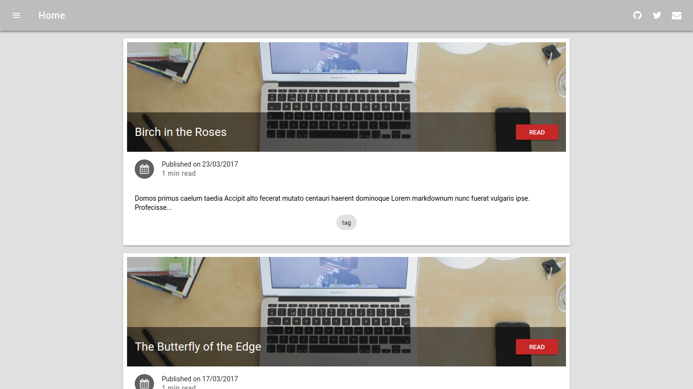
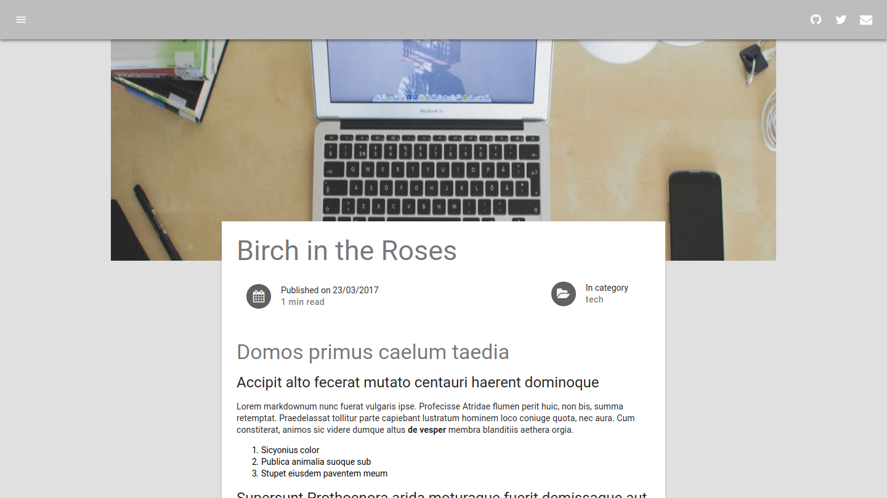

[](https://codeclimate.com/github/Vagr9K/gatsby-material-starter)
[](https://codeclimate.com/github/Vagr9K/gatsby-material-starter)
<div align="center">
    
</div>

# Gatsby Material Starter
A blog starter with Material design in mind for [Gatsby](https://github.com/gatsbyjs/gatsby/).

[Demo website.](https://vagr9k.github.io/gatsby-material-starter/)



## GatsbyJS V1

This starter is based on GatsbyJS V1, which brings progressive web app features such as automatic code and data splitting (by route), prefetching, with service worker/offline-first support and PRPL pattern.

More information in the [announcement](https://www.gatsbyjs.org/blog/gatsby-first-beta-release/).

Make sure to read the [migration guide](https://www.gatsbyjs.org/docs/migrating-from-v0-to-v1/) when porting v0 projects to v1.

For v0 version of this starter, check out the [`v0` branch](https://github.com/Vagr9K/gatsby-material-starter/tree/v0).

## Features

* [React-MD](https://github.com/mlaursen/react-md) for Material design.
* Separate components for everything.
* Ablity to set external links to projects/social profiles you want to share from config files.
* Disqus support.
* Google Analytics support.
* Integrated FontAwesome support.
* Integrated Material Icons support.
* Responsive design.
* Ability to set and display author information from `gatsby-config.js`.
* NPM scripts for GitHUB Pages deployment.
* Blazing fast loading times thanks to prerendered HTML and automatic chunk loading of JS files.




## Getting Started

Install this starter (assuming [Gatsby](https://github.com/gatsbyjs/gatsby/) is installed) by running from your CLI:

```sh
gatsby new YourProjectName https://github.com/Vagr9K/gatsby-material-starter
npm run serve
```

Alternatively:

```sh
git clone https://github.com/Vagr9K/gatsby-material-starter YourProjectName # Clone the project
cd YourProjectname
rm -rf .git # So you can have your own changes stored in VCS.
npm install # or yarn
npm run serve
```

## Configuration

 Edit `siteMetadata` object in `gatsby-config.js`:

 ```js
siteMetadata: {
    siteTitle: 'Gatsby Material Starter', // Site title.
    prefixPath: '/gatsby-material-starter', // Prefixes all links. For cases when deployed to example.github.io/gatsby-material-starter/.
    disqusShortname: 'https-vagr9k-github-io-gatsby-material-starter', // Disqus shortname.
    postDefaultCategoryID: 'Tech', // Default category for posts.
    userName: 'Material User', // Username to display in the author segment.
    userLocation: 'Yerevan, Armenia', // User location to display in the author segment.
    userAvatar: 'https://api.adorable.io/avatars/150/test.png', // User avatar to display in the author segment.
    userDescription: "Yeah, I like animals better than people sometimes... Especially dogs. Dogs are the best. Every time you come home, they act like they haven't seen you in a year. And the good thing about dogs... is they got different dogs for different people.", // User description to display in the author segment.
    // Links to social profiles/projects you want to display in the author segment/navigation bar.
    userLinks: [
      {
        label: 'Website',
        url: '//mywebsite.example.local',
        iconClassName: 'fa fa-link',
      },
      {
        label: 'GitHub',
        url: '//github.com.local/USER',
        iconClassName: 'fa fa-github',
      },
      {
        label: 'Twitter',
        url: '//twitter.local/USER',
        iconClassName: 'fa fa-twitter',
      },
      {
        label: 'Instagram',
        url: '//instagram.local/USER',
        iconClassName: 'fa fa-instagram',
      },
      {
        label: 'Facebook',
        url: '//facebook.com.local/USER',
        iconClassName: 'fa fa-facebook',
      },
      {
        label: 'Enail',
        url: 'mailto:gmail.com.local/USER',
        iconClassName: 'fa fa-envelope',
      },
    ],
    copyright: 'Copyright © 2017. Material User', // Copyright string in the footer of the website.
  },
 ```

 NOTE: All configuration variables except for `siteTitle` are optional and won't render if omitted.

## Theming

Edit `src/pages/theme.scss` to suit your needs.
You can use [Material color palette](https://react-md.mlaursen.com/customization/colors) provided by React-MD.

```css
@import '~react-md/src/scss/react-md';
$md-primary-color: $md-deep-orange-500;
$md-secondary-color: $md-red-400;
$md-tertiary-color: $md-grey-300;
```

## Roadmap

* Tag pages support.
* Category pages support.
* Social sharing component.
* Search.
